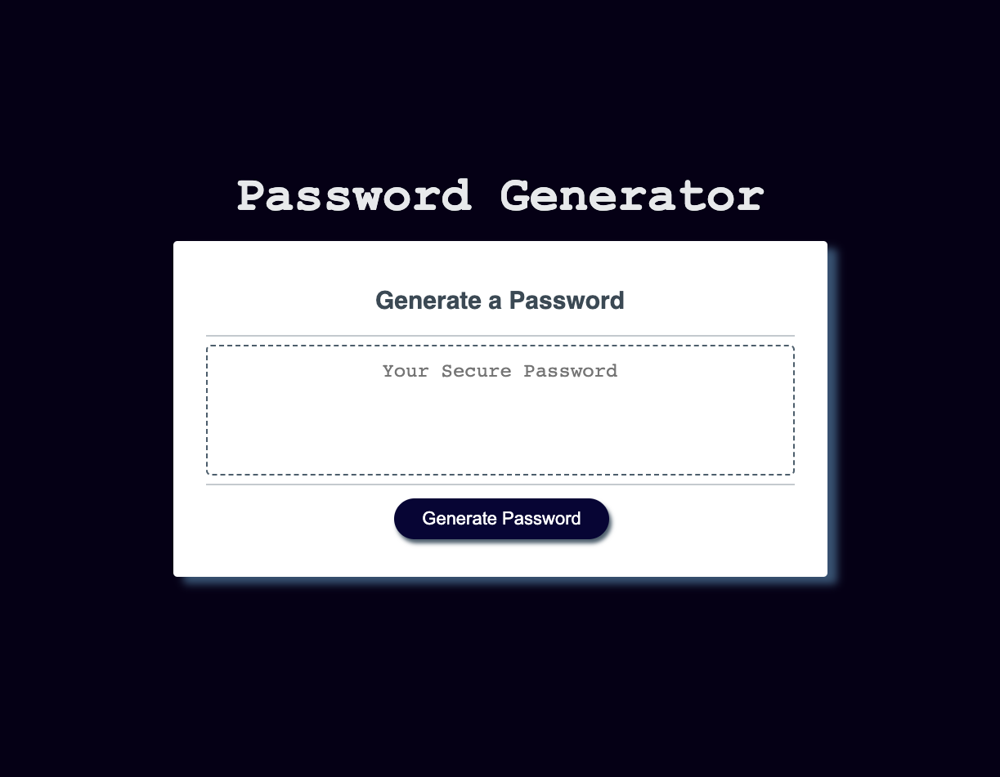

# HW03-Password-Generator

## Description 
Implemented JavaScript to pre-existing HTML and CSS to create a random password generator. It allows users to generate a completely randomized password.  First, the user is met with a prompt to choose their ideal character length.  If  the user puts in an amount less than or greater than the specified amount, the user is met with an alert telling them to input the proper character length parameters and to try again.  The user is then met with 4 options of possible character types with no limitations as to how many they would like to use. After completing the prompts, the user receives a random password.  
#
## Screenshot

#
## Changes Made
The HTML and CSS were provided, however i did change some CSS.  Mostly color properties and adding some shadows. 
#
## Link to Page

s